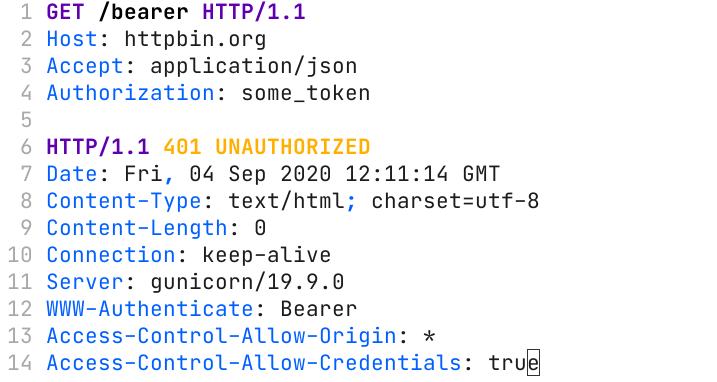

# vim-http-simple
Simple HTTP Client for Vim (Work in progress)



## Installation

### Using vim-plug

Add the following to your `~/.vimrc`:
```
Plug 'honsiorovskyi/vim-http-simple'
```

Run:
```
:source ~/.vimrc
:PlugInstall
:source ~/.vimrc
```

### Manual

Copy the contents of the `plugin` and `syntax` folders to the corresponding folders inside your `~/.vim`.

## Usage

Given an example HTTP request:
```
GET /bearer HTTP/1.1
Host: httpbin.org
Accept: application/json
Authorization: some_token
```

Select all the lines of the request, then type the following and press **Enter**:
```
:'<,'>HttpRequest
```
